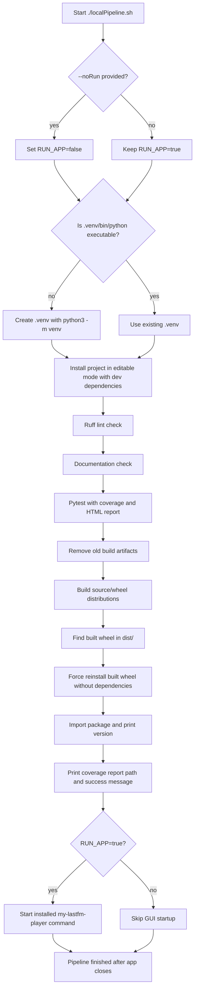

# myLastFmPlayer

`myLastFmPlayer` is a (Linux) desktop application for collecting a user's loved tracks from Last.fm, preparing them for lookup/download, and eventually playing downloaded audio locally. The MVP is implemented in Python with PyQt.

Author: Marcel Petrick <mail@marcelpetrick.it>

License: GPLv3 or later. See `LICENSE`.

Current version: `00.00.15`

## Versioning

This project uses a two-digit SemVer-style version number:

```text
MAJOR.MINOR.PATCH
```

Each numeric part is written with two digits. The first version was `00.00.01`.

- `MAJOR`: incompatible or breaking changes.
- `MINOR`: backwards-compatible feature additions.
- `PATCH`: fixes, documentation, tooling, and other incremental changes.

For this project, every future commit should increase the `PATCH` number unless the change intentionally requires a `MINOR` or `MAJOR` bump.

## Requirements

- Linux x86_64
- Python 3.11 or newer
- `venv` support for Python

Later MVP steps will also require:

- `yt-dlp`
- `ffmpeg`

On Manjaro:

```sh
sudo pacman -S yt-dlp ffmpeg
```

## Build and Run with a Virtual Environment

Create the virtual environment:

```sh
python3 -m venv .venv
```

Activate it:

```sh
source .venv/bin/activate
```

Install the app in editable mode:

```sh
python -m pip install --upgrade pip
python -m pip install -e .
```

Run the app:

```sh
my-lastfm-player
```

Alternatively:

```sh
python -m my_lastfm_player
```

## Local Pipeline

Install development dependencies and run the full local build, lint, documentation, test, coverage, package, install verification sequence, and then start the installed application:

```sh
./localPipeline.sh
```

The pipeline uses `.venv`, creates it when missing, installs the project with development dependencies, runs Ruff, checks required documentation, runs pytest with coverage, builds the package, installs the built wheel, verifies the package can be imported, and then starts `my-lastfm-player` like a user would.

### Build Workflow

`localPipeline.sh` is the canonical local build workflow. It fails immediately when a required command fails, so later phases only run after earlier validation has passed.



The workflow phases are:

1. Argument handling: accepts only `--noRun`; any other argument stops the pipeline with usage help.
2. Environment preparation: creates `.venv` only when `.venv/bin/python` is missing, otherwise reuses the existing virtual environment.
3. Dependency installation: runs `python -m pip install -e ".[dev]"` so the app and development tools come from the same environment.
4. Quality gates: runs Ruff, required documentation checks, and pytest with configured coverage reporting.
5. Package build: removes stale `build/`, `dist/`, and egg-info output before running `python -m build`.
6. Install verification: installs the freshly built wheel and imports `my_lastfm_player` to confirm the packaged application exposes its version.
7. Runtime smoke check: starts `my-lastfm-player` unless `--noRun` was provided.

To run every check without launching the GUI at the end:

```sh
./localPipeline.sh --noRun
```

After the pipeline completes, open the HTML coverage report at:

```sh
htmlcov/index.html
```

The normal pipeline does not require internet access. To include the live Last.fm end-to-end test for the hardwired user `first`, run:

```sh
MY_LASTFM_PLAYER_RUN_LASTFM_E2E=1 ./localPipeline.sh --noRun
```

That test fetches all loved-track pages from Last.fm for `first` and prints the tracks during the test run.

## Current State

Steps 0 through 8 of the development plan are implemented through the explicit download-queue action. Automatic fetch-to-lookup-to-download orchestration and playback are still planned in `documents/02_DEVELOPMENT_PLAN.md`.
