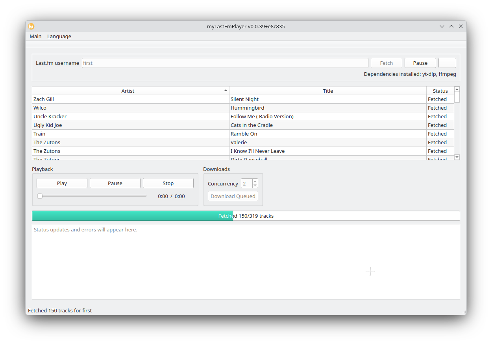
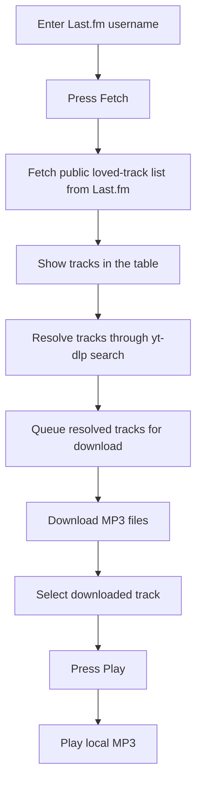
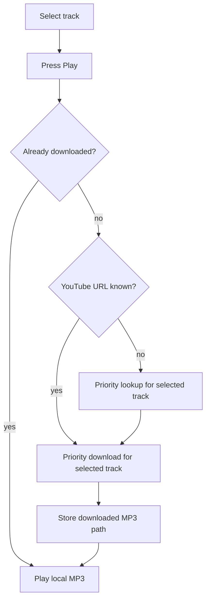
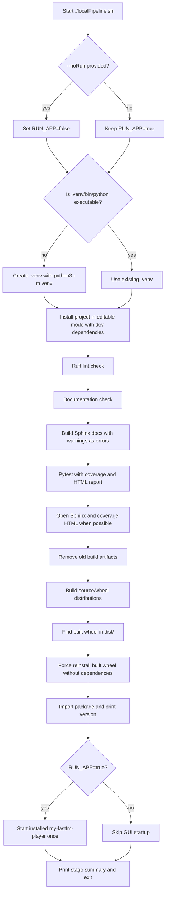

# myLastFmPlayer

`myLastFmPlayer` is a (Linux) desktop application for collecting a user's loved tracks from Last.fm, preparing them for lookup/download, and eventually playing downloaded audio locally. The MVP is implemented in Python with PyQt.

**Author: Marcel Petrick <mail@marcelpetrick.it>**

**Note: projected is generated with AI.**

**License: GPLv3 or later. See `LICENSE`.**

Current version: `0.0.58` - work in progress; tons of features are not implemented

## Current state



## Versioning

This project uses a SemVer-style base version:

```text
MAJOR.MINOR.PATCH
```

The version is written without leading zero padding. The first version was `0.0.1`.
The single source of truth is `my_lastfm_player/version.py`; Python package metadata reads
the same `__version__` value through `pyproject.toml`.

- `MAJOR`: incompatible or breaking changes.
- `MINOR`: backwards-compatible feature additions.
- `PATCH`: fixes, documentation, tooling, and other incremental changes.

For this project, every future commit should increase the `PATCH` number unless the change intentionally requires a `MINOR` or `MAJOR` bump.

Built packages can show a build suffix in user-facing locations such as the startup
line and window title. The suffix is the first six digits of the git commit hash,
generated at package build time into `my_lastfm_player/_build_info.py`. Source-tree
development runs show only the base version when that generated metadata is absent.

## Requirements

- Linux x86_64
- Python 3.12 or newer
- `venv` support for Python

Later MVP steps will also require:

- `yt-dlp`
- `ffmpeg`

On Manjaro:

```sh
sudo pacman -S yt-dlp ffmpeg
```

## Build and Run with a Virtual Environment

Create the virtual environment:

```sh
python3 -m venv .venv
```

Activate it:

```sh
source .venv/bin/activate
```

Install the app in editable mode:

```sh
python -m pip install --upgrade pip
python -m pip install -e .
```

Run the app:

```sh
my-lastfm-player
```

Alternatively:

```sh
python -m my_lastfm_player
```

## Last.fm Scrobbling Credentials

The app ships with Last.fm desktop application credentials so scrobbling can work
without every user registering a separate Last.fm API account:

- API key: `d36dce7154716e08a1d2907b7badadf7`
- Shared secret: `ed22747b03cabe49ab93f7215afc06fc`

These are application credentials, not a user's Last.fm password or session key.
Last.fm's desktop authentication flow requires a key and shared secret to sign
the app's requests, while the per-user session key is created only after the user
approves access in the browser. For desktop apps, these app credentials cannot be
kept confidential from users of the binary or source; larger open-source music
clients such as Strawberry follow the same practical model by shipping a shared
Last.fm API key for all users.

Advanced users and downstream packages can override the bundled credentials
without patching source:

```sh
LASTFM_API_KEY=your_key LASTFM_API_SECRET=your_secret my-lastfm-player
```

## How to Use the Player

Start the application, enter a Last.fm username, and press Fetch. The app loads that user's public loved-track list from Last.fm, stores it locally, resolves the tracks through `yt-dlp`, and starts downloading playable MP3 files into the local downloads directory.

The normal workflow is:

1. Enter a Last.fm username.
2. Press Fetch.
3. Wait while the loved-track list is fetched and shown in the table.
4. The app automatically starts YouTube lookup for the fetched tracks.
5. The app automatically starts the download queue for resolved tracks.
6. Select a downloaded track and press Play.



If you press Play on a track that is not downloaded yet, the app prepares that selection first. It prioritizes the selected track, resolves its YouTube URL if needed, downloads only that track first, and then starts playback when the local file is ready.



Progress and errors are shown in the status bar at the bottom of the window and in the feedback area. The terminal also prints detailed logging when the app is started from `localPipeline.sh` or from a shell.

```text
========== Local Pipeline Summary ==========
Virtualenv       : PASS .venv is available
Dependencies     : PASS Editable install with dev dependencies completed
Ruff             : PASS Lint check completed
Docs             : PASS Required documentation checks completed
Sphinx           : PASS HTML documentation built with warnings as errors
Tests+Coverage   : PASS pytest completed and generated htmlcov
Open Docs        : PASS Sphinx index.html was handed to firefox
Open Coverage    : PASS htmlcov/index.html was handed to firefox
Clean Build      : PASS Stale package artifacts removed
Package Build    : PASS Source and wheel distributions built
Wheel            : PASS Found built wheel in dist/
Wheel Install    : PASS Built wheel installed into .venv
Import Check     : PASS Installed package imports successfully
Launch App       : PASS my-lastfm-player was started once
============================================
```

## Stored Files

By default, downloaded MP3 files are stored here:

```text
~/.local/share/myLastFmPlayer/downloads/
```

Per-user track lists are stored as JSON files here:

```text
~/.local/share/myLastFmPlayer/tracks/
```

The shared download cache is stored here:

```text
~/.local/share/myLastFmPlayer/download-cache.json
```

The shared YouTube lookup cache is stored here:

```text
~/.local/share/myLastFmPlayer/lookup-cache.json
```

If `XDG_DATA_HOME` is set, the base directory changes to:

```text
$XDG_DATA_HOME/myLastFmPlayer/
```

For example, with `XDG_DATA_HOME=/tmp/app-data`, downloads are stored in:

```text
/tmp/app-data/myLastFmPlayer/downloads/
```

## Local Pipeline

Install development dependencies and run the full local build, lint, documentation, test, coverage, package, install verification sequence, and then start the installed application once:

```sh
./localPipeline.sh
```

The pipeline uses `.venv`, creates it when missing, installs the project with development dependencies, runs Ruff, checks required documentation, builds Sphinx documentation into `docs/_build/html`, runs pytest with coverage, opens the generated HTML reports when possible, builds the package, installs the built wheel, verifies the package can be imported, and then starts `my-lastfm-player` like a user would. Without `--noRun`, the app is started once and the launch stage is marked successful after the process is handed off.

### Build Workflow

`localPipeline.sh` is the canonical local build workflow. It records each stage as `PASS`, `FAIL`, `SKIP`, or `WARN` and prints the complete summary at the end, so a developer can see the build state in one place.



The workflow phases are:

1. Argument handling: accepts only `--noRun`; any other argument stops the pipeline with usage help.
2. Environment preparation: creates `.venv` only when `.venv/bin/python` is missing, otherwise reuses the existing virtual environment.
3. Dependency installation: runs `python -m pip install -e ".[dev]"` so the app and development tools come from the same environment.
4. Quality gates: runs Ruff, required documentation checks, Sphinx documentation with warnings as errors, and pytest with configured coverage reporting.
5. Report opening: prints the Sphinx and coverage HTML paths and tries to open them with `MY_LASTFM_PLAYER_REPORT_BROWSER` when set, otherwise `firefox`, otherwise `xdg-open`, otherwise `open`; a failed auto-open is reported as `WARN`, not as a failed build.
6. Package build: removes stale package `build/`, `dist/`, and egg-info output before running `python -m build`; generated Sphinx HTML in `docs/_build/html` is kept usable after the package build.
7. Install verification: installs the freshly built wheel and imports `my_lastfm_player` to confirm the packaged application exposes its version.
8. Runtime launch: starts `my-lastfm-player` once unless `--noRun` was provided; quitting the app does not make the pipeline reopen it.
9. Final summary: prints a stage-by-stage table so the developer can see which parts passed, failed, were skipped, or only produced warnings.

To run every check without launching the GUI at the end:

```sh
./localPipeline.sh --noRun
```

After the pipeline completes, open the HTML coverage report at:

```sh
htmlcov/index.html
```

After the pipeline completes, open the Sphinx documentation at:

```sh
docs/_build/html/index.html
```

The normal pipeline does not require internet access. To include the live Last.fm end-to-end test for the hardwired user `first`, run:

```sh
MY_LASTFM_PLAYER_RUN_LASTFM_E2E=1 ./localPipeline.sh --noRun
```

That test fetches all loved-track pages from Last.fm for `first` and prints the tracks during the test run.

## Translations

The UI is prepared for Qt Linguist translations. English is the source/default language, and `.ts` files are available for Croatian, German, Mandarin, and Ukrainian in:

```text
my_lastfm_player/translations/
```

Regenerate the Qt translation source files after changing user-visible strings:

```sh
tools/update_translations.sh
```

After editing the `.ts` files with Qt Linguist or another Qt-compatible translation tool, compile runtime `.qm` files:

```sh
tools/compile_translations.sh
```

## Current State

Steps 0 through 10 of the development plan are implemented for the local MVP path: fetching a username now continues automatically into YouTube lookup and the download queue, and downloaded tracks can be played locally. Pressing Play on a not-yet-downloaded track starts a priority lookup/download for that selection. Remaining hardening topics are tracked in `documents/05_IMPROVEMENTS.md`.
