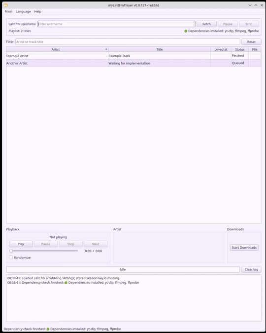
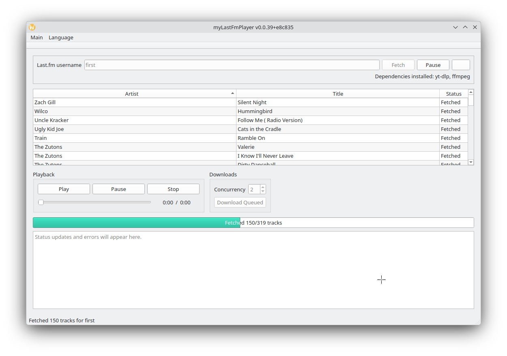
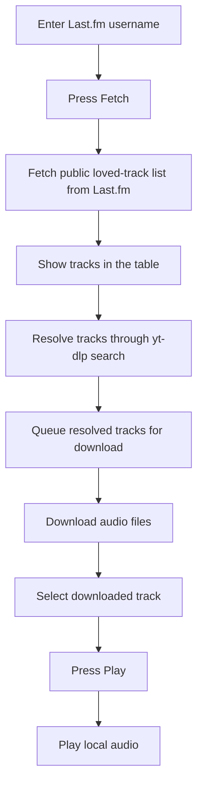
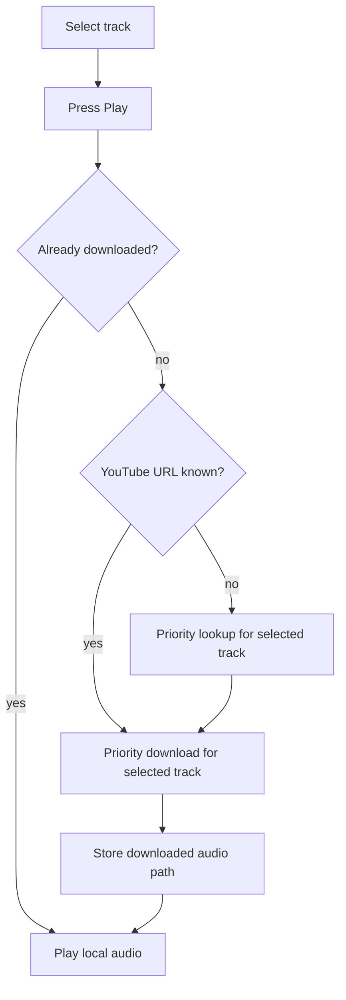
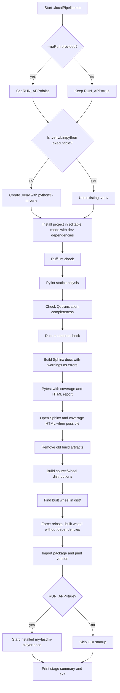

# myLastFmPlayer

[](https://github.com/marcelpetrick/myLastFmPlayer/actions/workflows/local-pipeline.yml)
[](https://github.com/marcelpetrick/myLastFmPlayer/actions/workflows/manual-release.yml)

`myLastFmPlayer` is a maintained Linux desktop application that turns a Last.fm
loved-track history into a local, playable music library. It discovers tracks from
Last.fm, finds playable sources through YouTube, downloads audio files, and plays them
locally from one PyQt6 interface.

**Author: Marcel Petrick <mail@marcelpetrick.it>**

**License: GPLv3 or later. See `LICENSE`.**

**Note: project is generated with AI.**

## Product Status

Current version: `0.0.173` — fully usable and actively maintained

The complete intended workflow is implemented and used in practice. Its major features
are covered by the automated test suite, packaging and installed-application checks,
with opt-in live integration tests for Last.fm and `yt-dlp`. Development continues
through fixes, compatibility updates, usability improvements, and carefully scoped
extensions rather than completion of missing core features.

## Major Features

- Fetches any user's public loved tracks through the Last.fm Web API.
- Shows partial results immediately while later Last.fm pages are still loading.
- Searches YouTube and downloads resolved tracks automatically through `yt-dlp`.
- Runs up to five YouTube checks and downloads concurrently, configurable from one to five.
- Keeps each track independent, so one failed lookup or download does not stop the queue.
- Shows independent Last.fm discovery, YouTube-check, and download progress.
- Lets the user stop active YouTube work, keep completed items, and resume the remaining queue.
- Lets the user switch Last.fm usernames while work is active, with clean cancellation and
  isolation from late background updates.
- Prioritizes a selected track for lookup and download when Play is pressed before it is local.
- Plays local tracks with seek, volume, mute, next-track, and randomized continuation controls.
- Keeps long now-playing details available without widening the window and scrolls
  Preferences within the available screen at larger font sizes.
- Shows artist artwork with a link to the artist's Last.fm page.
- Retries transient lookup and download failures and rechecks unfinished work after startup.
- Explains per-track failures in tooltips and provides status-aware retry actions and filtering.
- Stores per-user libraries and caches locally and retains them across restarts by default.
- Supports optional authenticated Last.fm scrobbling.
- Includes light, dark, lilac, and mint themes plus English, Croatian, German, Mandarin,
  and Ukrainian interfaces.

## Interface

[](media/myLastFmPlayer_v0.0.127_recording.webm)

Click the preview to open the full recording.



## Versioning

This project uses a SemVer-style base version:

```text
MAJOR.MINOR.PATCH
```

The version is written without leading zero padding. The first version was `0.0.1`.
The single source of truth is `my_lastfm_player/version.py`; Python package metadata reads
the same `__version__` value through `pyproject.toml`.

- `MAJOR`: incompatible or breaking changes.
- `MINOR`: backwards-compatible feature additions.
- `PATCH`: fixes, documentation, tooling, and other incremental changes.

For this project, every future commit should increase the `PATCH` number unless the change intentionally requires a `MINOR` or `MAJOR` bump.

Built packages can show a build suffix in user-facing locations such as the startup
line and window title. The suffix is the first six digits of the git commit hash,
generated at package build time into `my_lastfm_player/_build_info.py`. Source-tree
development runs show only the base version when that generated metadata is absent.

## Installation and Requirements

Download a wheel or source archive from the
[GitHub Releases page](https://github.com/marcelpetrick/myLastFmPlayer/releases), or install
from a source checkout. The application requires:

- Linux x86_64
- Python 3.14 or newer with `venv` support
- `yt-dlp`
- `ffmpeg` and `ffprobe`

On Manjaro, install the external tools with:

```sh
sudo pacman -S yt-dlp ffmpeg
```

### Install a Release Wheel

Create an isolated environment and install the downloaded wheel:

```sh
python3 -m venv .venv
source .venv/bin/activate
python -m pip install /path/to/my_lastfm_player-0.0.173-py3-none-any.whl
my-lastfm-player
```

### Run from a Source Checkout

Create the virtual environment:

```sh
python3 -m venv .venv
```

Activate it:

```sh
source .venv/bin/activate
```

Install the app in editable mode:

```sh
python -m pip install --upgrade pip
python -m pip install -e .
```

Run the app:

```sh
my-lastfm-player
```

Alternatively:

```sh
python -m my_lastfm_player
```

## Last.fm API Credentials

The app ships with Last.fm desktop application credentials so loved-track fetching
and scrobbling can work without every user registering a separate Last.fm API
account:

- API key: `d36dce7154716e08a1d2907b7badadf7`
- Shared secret: `ed22747b03cabe49ab93f7215afc06fc`

These are application credentials, not a user's Last.fm password or session key.
Public loved-track fetching uses the API key only. Last.fm's desktop
authentication flow for scrobbling also requires the shared secret to sign the
app's requests, while the per-user session key is created only after the user
approves access in the browser. For desktop apps, these app credentials cannot
be kept confidential from users of the binary or source; larger open-source
music clients such as Strawberry follow the same practical model by shipping a
shared Last.fm API key for all users.

Advanced users and downstream packages can override the bundled credentials
without patching source:

```sh
LASTFM_API_KEY=your_key LASTFM_API_SECRET=your_secret my-lastfm-player
```

## How to Use the Player

Start the application, enter a Last.fm username, and press Fetch. The app loads that
user's public loved-track list, stores it locally, resolves tracks through `yt-dlp`,
and downloads playable audio files into the local downloads directory. No Last.fm login
is required to fetch a public library.

The normal workflow is:

1. Enter a Last.fm username.
2. Press Fetch.
3. Wait while the loved-track list is fetched and shown in the table.
4. The app automatically starts YouTube lookup for the fetched tracks.
5. The app automatically starts the download queue for resolved tracks.
6. Select a downloaded track and press Play.

Use **Stop YouTube** at any time to stop active checks and downloads. Operations already
completed remain saved, active operations end cooperatively, and the button changes to
**Resume YouTube** when unresolved or queued tracks remain. Fetch pause and stop controls
apply specifically to Last.fm discovery.

Last.fm pages flow into YouTube lookup as they arrive, and resolved tracks can begin
downloading before the lookup batch is finished. One shared limit in Preferences caps
all YouTube checks and downloads together; it defaults to five and can be set from one
to five. Individual failures do not stop the remaining queue. You can also enter
another Last.fm username while work is active: the previous user's processes are
cancelled promptly, completed results remain saved, and late updates cannot replace
the new user's table.


```mermaid
flowchart TD
    A["Enter Last.fm username"] --> B["Press Fetch"]
    B --> C["Fetch public loved-track list from Last.fm"]
    C --> D["Show tracks in the table"]
    D --> E["Resolve tracks through yt-dlp search"]
    E --> F["Queue resolved tracks for download"]
    F --> G["Download audio files"]
    G --> H["Select downloaded track"]
    H --> I["Press Play"]
    I --> J["Play local audio"]
```

If you press Play on a track that is not downloaded yet, the app prepares that selection first. It prioritizes the selected track, resolves its YouTube URL if needed, downloads only that track first, and then starts playback when the local file is ready.


```mermaid
flowchart TD
    A["Select track"] --> B["Press Play"]
    B --> C{"Already downloaded?"}
    C -->|yes| D["Play local audio"]
    C -->|no| E{"YouTube URL known?"}
    E -->|no| F["Priority lookup for selected track"]
    E -->|yes| G["Priority download for selected track"]
    F --> G
    G --> H["Store downloaded audio path"]
    H --> D
```

Progress and errors appear in the progress area, status bar, and feedback log. Starting
the application from a shell also provides detailed operational logging.

### Recovering Tracks That Failed Earlier

`Not found` and `Failed` are verdicts about YouTube rather than about the track, and
YouTube changes its mind, so the player keeps re-checking them:

- **Downloads** retry over a ladder of YouTube player clients. YouTube gates some of its
  internal clients, and a gated one offers no audio at all, so retrying the same client
  cannot help; each retry forces a different one instead.
- **Lookups** try several searches — artist and title, the artist stripped of store
  suffixes and decorative symbols, then the title alone — before giving up. A miss counts
  as one attempt out of a few, not as a permanent verdict.
- **On startup** the player automatically re-checks everything the previous run gave up
  on: tracks marked `Not found` are searched again, and `Failed` downloads are queued
  again. Nothing happens when no track is stuck.

## Stored Files

Saved libraries, lookup results, download metadata, and the optional Last.fm session are
retained when the application closes. This is the safe default. Preferences can opt into
deleting that metadata on quit; the downloaded audio files are always retained.

By default, downloaded audio files are stored here:

```text
~/.local/share/myLastFmPlayer/downloads/
```

Per-user track lists are stored as JSON files here:

```text
~/.local/share/myLastFmPlayer/tracks/
```

Active workflows also use a per-user `.updates.jsonl` journal in that directory so
completed entries survive a stop or interruption before the full snapshot is compacted.

The shared download cache is stored here:

```text
~/.local/share/myLastFmPlayer/download-cache.json
```

The shared YouTube lookup cache is stored here:

```text
~/.local/share/myLastFmPlayer/lookup-cache.json
```

The optional Last.fm session is stored in `lastfm-credentials.json`. Appearance and
behavior preferences use the platform-native Qt settings store rather than this data
directory.

If `XDG_DATA_HOME` is set, the base directory changes to:

```text
$XDG_DATA_HOME/myLastFmPlayer/
```

For example, with `XDG_DATA_HOME=/tmp/app-data`, downloads are stored in:

```text
/tmp/app-data/myLastFmPlayer/downloads/
```

## Quality and Verification

Every change must pass the repository's complete local pipeline before it is committed.
The gate requires zero Ruff violations, a 10.00/10 Pylint score, complete translations,
warning-free documentation, the configured 99% coverage threshold, successful source and
wheel builds, installation of the newly built wheel, an import/version check, and a launch
of the installed application. Tests cover the UI state, controller workflows, storage,
parallel lookup/download behavior, cancellation, playback, scrobbling, localization, and
release artifacts.

Network-dependent tests are kept opt-in so the normal gate remains deterministic. They can
validate a full Last.fm library fetch and real `yt-dlp` client/format/download behavior
against the live services.

## Local Pipeline

Install development dependencies and run the full local build, lint, documentation, test, coverage, package, install verification sequence, and then start the installed application once:

```sh
./localPipeline.sh
```

The pipeline uses `.venv`, creates it when missing, installs the project with development dependencies, runs Ruff, Pylint (10.00/10 required), checks translations (0 untranslated strings required), checks required documentation, builds Sphinx documentation into `docs/_build/html`, runs pytest with coverage, opens the generated HTML reports when possible, builds the package, installs the built wheel, verifies the package can be imported, and then starts `my-lastfm-player` like a user would. Without `--noRun`, the app is started once and the launch stage is marked successful after the process is handed off.

### Build Workflow

`localPipeline.sh` is the canonical local build workflow. It records each stage as `PASS`, `FAIL`, `SKIP`, or `WARN` and prints the complete summary at the end, so a developer can see the build state in one place.


```mermaid
flowchart TD
    A["Start ./localPipeline.sh"] --> B{"--noRun provided?"}
    B -->|yes| C["Set RUN_APP=false"]
    B -->|no| D["Keep RUN_APP=true"]
    C --> E{"Is .venv/bin/python executable?"}
    D --> E
    E -->|no| F["Create .venv with python3 -m venv"]
    E -->|yes| G["Use existing .venv"]
    F --> H["Install project in editable mode with dev dependencies"]
    G --> H
    H --> I["Ruff lint check"]
    I --> J["Pylint static analysis"]
    J --> K["Check Qt translation completeness"]
    K --> L["Documentation check"]
    L --> M["Build Sphinx docs with warnings as errors"]
    M --> N["Pytest with coverage and HTML report"]
    N --> O["Open Sphinx and coverage HTML when possible"]
    O --> P["Remove old build artifacts"]
    P --> Q["Build source/wheel distributions"]
    Q --> R["Find built wheel in dist/"]
    R --> S["Force reinstall built wheel without dependencies"]
    S --> T["Import package and print version"]
    T --> U{"RUN_APP=true?"}
    U -->|yes| V["Start installed my-lastfm-player once"]
    U -->|no| W["Skip GUI startup"]
    V --> X["Print stage summary and exit"]
    W --> X
```

The workflow phases are:

1. Argument handling: accepts `--noRun` and `--report-dir PATH`; any other argument stops the pipeline with usage help.
2. Environment preparation: creates `.venv` only when `.venv/bin/python` is missing, otherwise reuses the existing virtual environment.
3. Dependency installation: runs `python -m pip install -e ".[dev]"` so the app and development tools come from the same environment.
4. Quality gates: runs Ruff (0 violations), Pylint (10.00/10), translations (0 untranslated strings across all locales), required documentation checks, Sphinx documentation with warnings as errors, and pytest with configured coverage reporting (99% minimum).
5. Report opening: prints the Sphinx and coverage HTML paths and tries to open them with `MY_LASTFM_PLAYER_REPORT_BROWSER` when set, otherwise `firefox`, otherwise `xdg-open`, otherwise `open`; a failed auto-open is reported as `WARN`, not as a failed build.
6. Package build: removes stale package `build/`, `dist/`, and egg-info output before running `python -m build`; generated Sphinx HTML in `docs/_build/html` is kept usable after the package build.
7. Install verification: installs the freshly built wheel and imports `my_lastfm_player` to confirm the packaged application exposes its version.
8. Runtime launch: starts `my-lastfm-player` once unless `--noRun` was provided; quitting the app does not make the pipeline reopen it.
9. Final summary: prints a stage-by-stage table so the developer can see which parts passed, failed, were skipped, or only produced warnings.

To run every check without launching the GUI at the end:

```sh
./localPipeline.sh --noRun
```

To preserve the machine-readable test and coverage results, stage logs,
environment metadata, and final summary:

```sh
./localPipeline.sh --noRun --report-dir release-artifacts/raw
```

The manual GitHub Release workflow uses these reports to publish seven
described ZIP archives: packages, Sphinx documentation, C4 architecture,
pytest results, coverage, static analysis, and the complete pipeline trace.
The raw wheel and source distribution remain separate release assets for
direct installation and packaging use.

After the pipeline completes, open the HTML coverage report at:

```sh
htmlcov/index.html
```

After the pipeline completes, open the Sphinx documentation at:

```sh
docs/_build/html/index.html
```

The normal pipeline does not require internet access. To include the live Last.fm end-to-end test for the hardwired user `first`, run:

```sh
MY_LASTFM_PLAYER_RUN_LASTFM_E2E=1 ./localPipeline.sh --noRun
```

That test fetches all loved-track API pages from Last.fm for `first` and prints the tracks during the test run.

To include the live yt-dlp end-to-end tests, run:

```sh
MY_LASTFM_PLAYER_RUN_YTDLP_E2E=1 ./localPipeline.sh --noRun
```

Those tests check the download retry ladder against the installed `yt-dlp`: every forced
YouTube player client must still be one `yt-dlp` supports, the audio format selector must
still resolve, and a real download must complete. A client name that `yt-dlp` no longer
knows is only reported as a skipped-client warning, so without this check that rung of the
ladder would quietly waste a retry.

## Translations

The UI is prepared for Qt Linguist translations. English is the source/default language, and `.ts` files are available for Croatian, German, Mandarin, and Ukrainian in:

```text
my_lastfm_player/translations/
```

Regenerate the Qt translation source files after changing user-visible strings:

```sh
tools/update_translations.sh
```

After editing the `.ts` files with Qt Linguist or another Qt-compatible translation tool, compile runtime `.qm` files:

```sh
tools/compile_translations.sh
```
