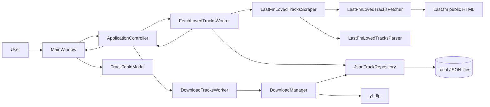
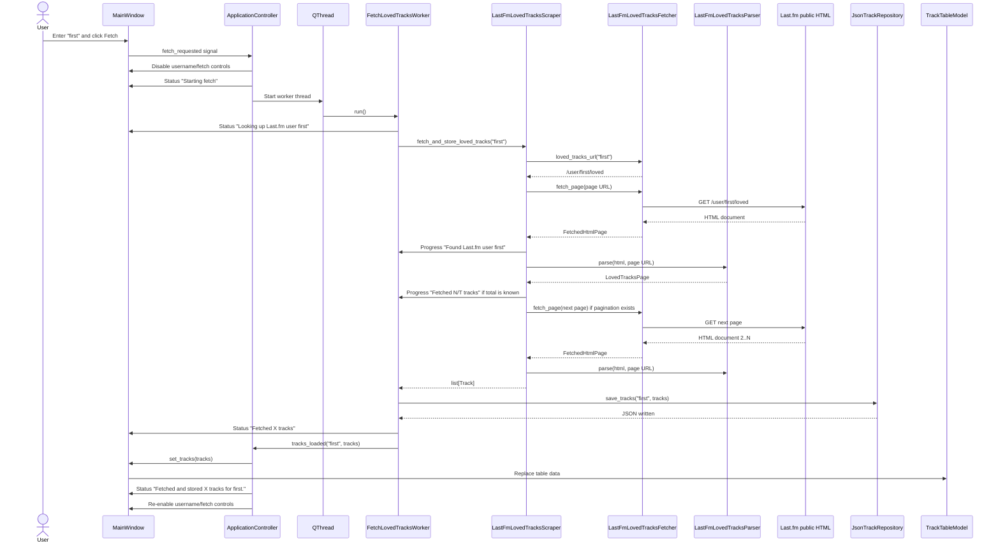
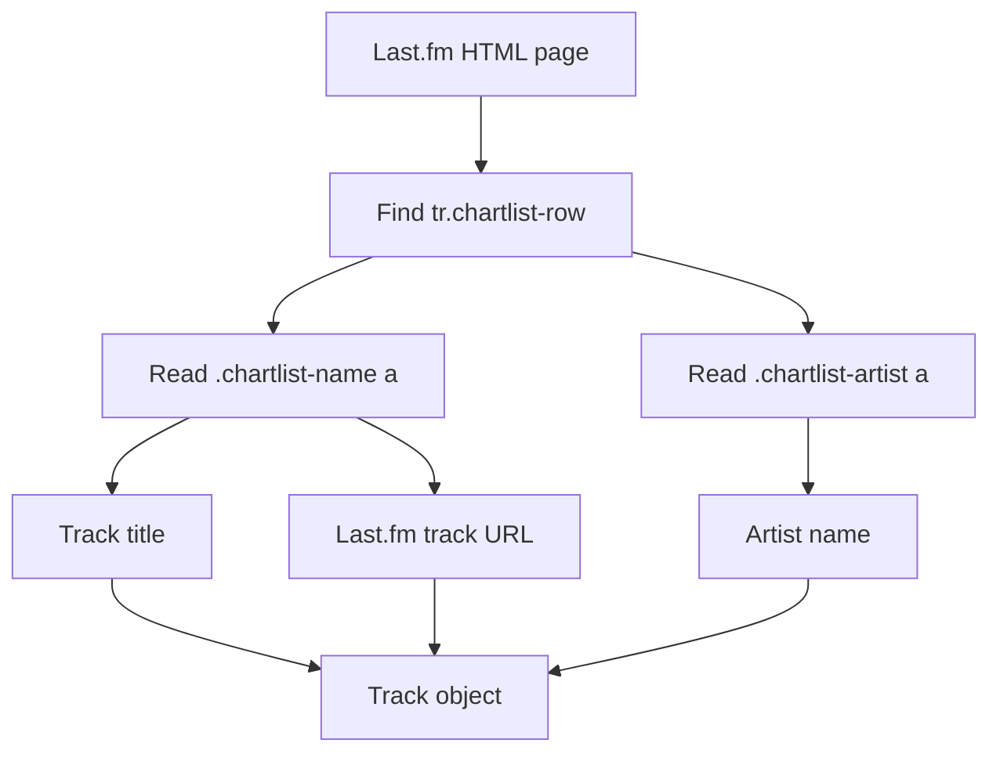
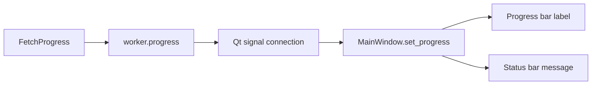
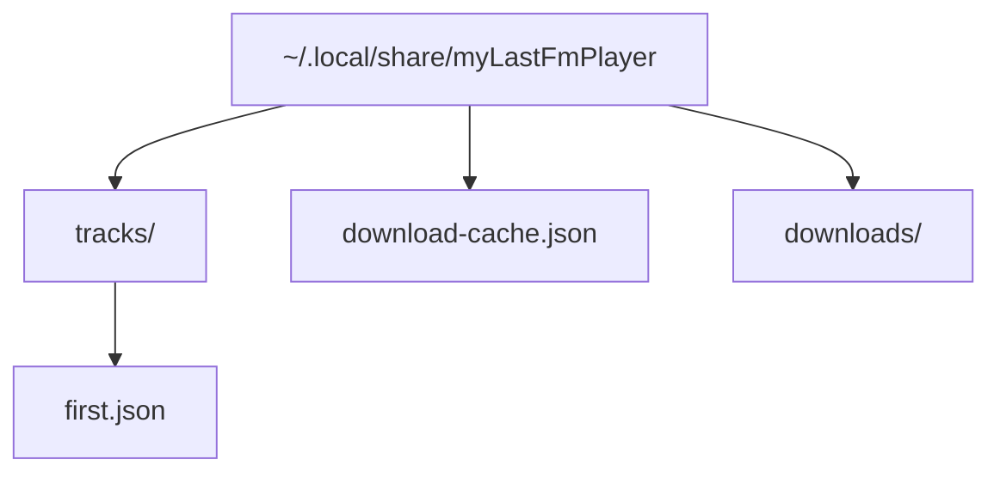
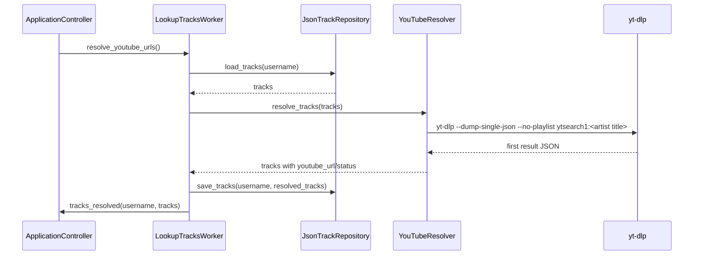
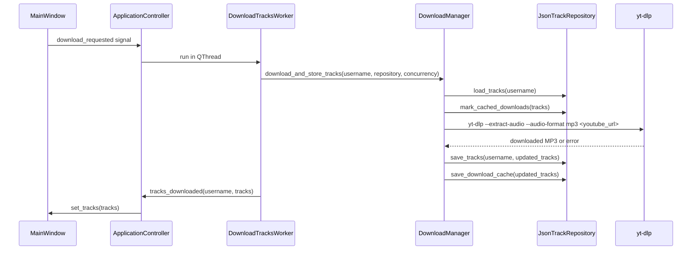
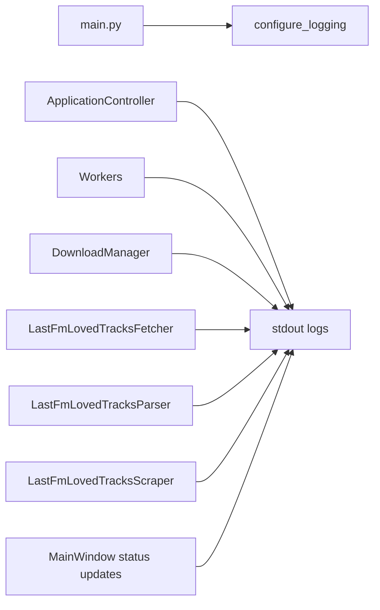

# Architecture

This document describes the workflow implemented in the application as of version `00.00.15`. It focuses on how a Last.fm username such as `first` is fetched, stored, and shown in the UI.

## Current Scope

Implemented:

- PyQt desktop shell.
- Last.fm loved-track scraping from public HTML pages.
- Background worker boundary for fetching.
- Per-user JSON storage.
- Track table model and UI data binding.
- YouTube lookup service and worker entry point.
- Download queue service and worker entry point.
- Startup checks for `yt-dlp` and `ffmpeg`.
- Status-bar progress and stdout logging.

Not yet implemented:

- Automatic YouTube lookup after fetching.
- Automatic download start after lookup.
- True pause/resume UI for active downloads.
- Playback.
- Full controller workflow from fetch to lookup to download to playback.

## Data Sources

The app currently uses these data sources:

| Source | Used For | Code |
| --- | --- | --- |
| Last.fm public HTML | Fetching loved tracks by username | `LastFmLovedTracksFetcher`, `LastFmLovedTracksParser`, `LastFmLovedTracksScraper` |
| Local JSON files | Persisting per-user track metadata | `JsonTrackRepository` |
| Shared local JSON cache | Remembering downloaded tracks by exact artist/title | `JsonTrackRepository` |
| `yt-dlp` command | YouTube first-result lookup and MP3 download | `YouTubeResolver`, `DownloadManager` |
| `shutil.which` | Startup dependency checks for `yt-dlp` and `ffmpeg` | `check_external_dependencies` |

For a username such as `first`, the Last.fm fetch URL is:

```text
https://www.last.fm/user/first/loved
```

Pagination follows links found in the HTML, for example:

```text
https://www.last.fm/user/first/loved?page=2
```

## High-Level Components



## Fetch Workflow

When the user enters `first` and clicks `Fetch`, this is the implemented workflow:



## Last.fm Parsing

The Last.fm implementation is split into three pieces:

- `LastFmLovedTracksFetcher`: recognizes the user URL and fetches HTML documents.
- `LastFmLovedTracksParser`: parses fetched HTML with BeautifulSoup.
- `LastFmLovedTracksScraper`: orchestrates pagination, progress, and storage-facing results.

The parser extracts tracks from Last.fm HTML table rows.



Each parsed `Track` currently stores:

- artist
- title
- Last.fm URL
- YouTube URL, initially `null`
- local file path, initially `null`
- status, initially `Fetched`
- retry count
- error

## Status-Bar Feedback

Fetch progress is sent through the worker to the UI status bar.



Examples of messages:

```text
Looking up Last.fm user first
Found Last.fm user first
Fetched 99/200 tracks
Fetched 200 tracks
Fetched and stored 200 tracks for first.
```

If the total count cannot be parsed from the page, the app still shows cumulative progress:

```text
Fetched 99 tracks
```

Errors follow the same path and are shown in the status bar and feedback log.

## Local Storage Layout

By default, user data is stored below:

```text
~/.local/share/myLastFmPlayer/
```

The important files are:



For username `first`, the per-user file is:

```text
~/.local/share/myLastFmPlayer/tracks/first.json
```

The JSON contains an array of track records.

## YouTube Lookup Workflow

The YouTube resolver is implemented, but it is not yet automatically started after fetching.



Current lookup rules:

- Query is exactly `<artist> <title>`.
- First result only.
- Found track becomes `Queued`.
- No result becomes `Not found`.

## Download Queue Workflow

Downloads are implemented as an explicit user action for queued tracks that already have a YouTube URL.



Current download rules:

- FIFO queue order by default.
- Default concurrency is `2`, controlled by the UI spin box.
- Tracks already in the shared cache are marked `Downloaded` and skipped.
- Each failing download is retried up to `3` times.
- Retry backoff is random between `1` and `5` seconds.
- A selected-track priority hook exists in the manager, but the UI does not expose it yet.

## Logging

The app configures logging to stdout at startup.



This makes fetch activity visible in the terminal when running:

```sh
my-lastfm-player
```

## Important Current Limitation

Fetching and displaying the Last.fm loved-track list is implemented, but the app still depends on Last.fm public HTML structure. If Last.fm changes class names or pagination markup, the scraper may need selector updates.
