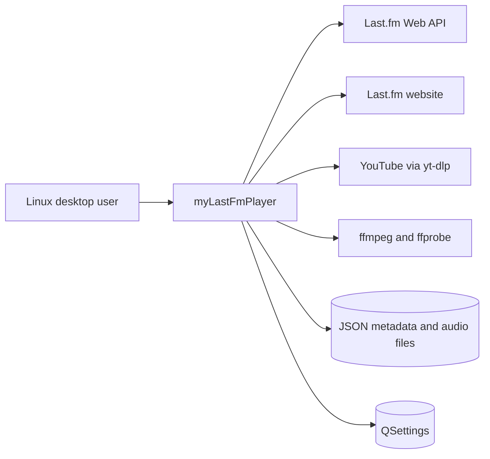
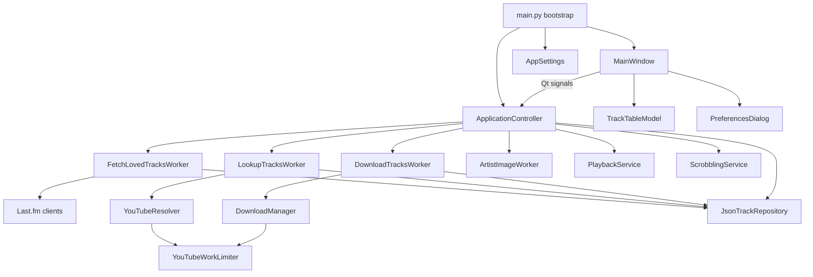
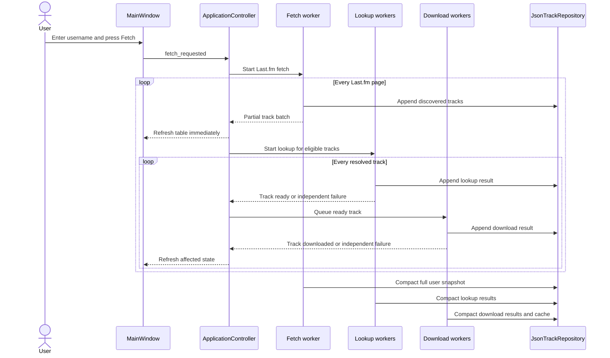
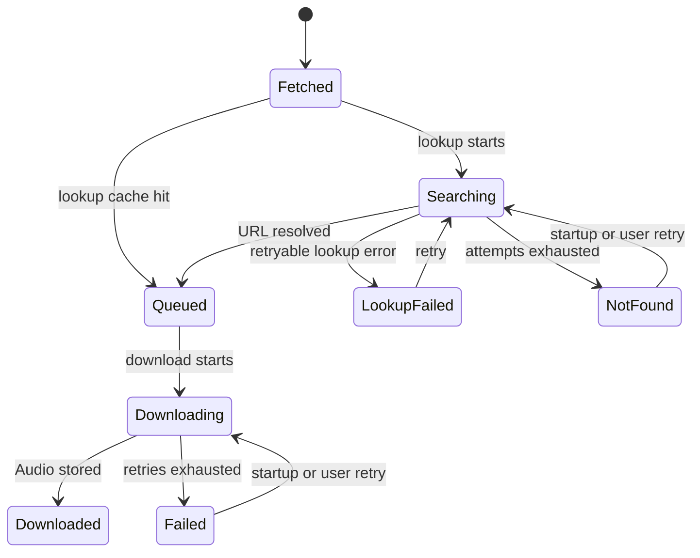

# Runtime Architecture

This document is the concise, implementation-facing architecture description for
`myLastFmPlayer` 0.0.175. The rendered C4 diagrams and class reference are in
[`docs/architecture.rst`](../docs/architecture.rst) and
[`docs/api.rst`](../docs/api.rst).

## System Purpose

`myLastFmPlayer` is a single-process Linux desktop application. A user enters a
Last.fm username; the application discovers that account's public loved tracks,
resolves playable YouTube sources, downloads audio, and plays the resulting
local library. Authenticated now-playing and scrobble updates are optional.

The application is designed around four properties:

- the Qt event loop remains responsive while network and subprocess work runs;
- each track progresses independently, so one failure does not stop the queue;
- completed work is persisted incrementally and survives cancellation or restart;
- work for one username cannot overwrite the visible state of another username.

## System Context

```mermaid
flowchart LR
    User[Linux desktop user] --> App[myLastFmPlayer]
    App --> LastFmApi[Last.fm Web API]
    App --> LastFmWeb[Last.fm website]
    App --> YouTube[YouTube via yt-dlp]
    App --> Media[ffmpeg and ffprobe]
    App --> Files[(JSON metadata and audio files)]
    App --> Settings[(QSettings)]
```

External responsibilities are:

| Dependency | Responsibility |
| --- | --- |
| Last.fm Web API | Loved-track pages and artist metadata |
| Last.fm website | Desktop authorization and artist-page links |
| `pylast` | Authenticated now-playing and scrobble API calls |
| `yt-dlp` | YouTube search and audio extraction |
| `ffmpeg` / `ffprobe` | Audio conversion and metadata probing |
| Qt Multimedia | Local playback |

The startup dependency check verifies that `yt-dlp`, `ffmpeg`, and `ffprobe` are
available. Loved-track discovery does not require user authentication; scrobbling
uses the bundled desktop application credentials plus a user-authorized session.

## Application Components

```mermaid
flowchart TB
    Main[main.py bootstrap] --> Window[MainWindow]
    Main --> Controller[ApplicationController]
    Main --> Settings[AppSettings]
    Window --> Table[TrackTableModel]
    Window --> Preferences[PreferencesDialog]
    Window -- Qt signals --> Controller

    Controller --> FetchWorker[FetchLovedTracksWorker]
    Controller --> LookupWorker[LookupTracksWorker]
    Controller --> DownloadWorker[DownloadTracksWorker]
    Controller --> ImageWorker[ArtistImageWorker]
    Controller --> Playback[PlaybackService]
    Controller --> Scrobbling[ScrobblingService]

    FetchWorker --> LastFm[Last.fm clients]
    LookupWorker --> Resolver[YouTubeResolver]
    DownloadWorker --> Downloader[DownloadManager]
    Resolver --> Limiter[YouTubeWorkLimiter]
    Downloader --> Limiter

    FetchWorker --> Repository[JsonTrackRepository]
    LookupWorker --> Repository
    DownloadWorker --> Repository
    Controller --> Repository
```

The main roles are:

- `MainWindow` owns widgets, user-facing signals, presentation state, and table
  interaction. `TrackTableModel` adapts immutable `Track` values to Qt's model API,
  including durable failure details exposed as row tooltips.
- `ApplicationController` coordinates workflows, scopes worker results by username
  and generation, translates service outcomes into UI state, and routes each worker's
  progress to its discovery, lookup, or download presentation channel.
- Worker `QObject`s run on owned `QThread`s and bridge Qt signals to blocking service
  operations.
- `LastFmLovedTracksScraper`, `YouTubeResolver`, `DownloadManager`,
  `PlaybackService`, and `ScrobblingService` contain service behavior without owning
  widgets.
- `YouTubeWorkLimiter` shares one configurable capacity across lookup and download
  subprocesses and prevents the same track from being processed twice concurrently.
- `JsonTrackRepository` is the persistent source of truth for track snapshots,
  incremental updates, caches, and Last.fm credentials.

## End-to-End Workflow

```mermaid
sequenceDiagram
    actor User
    participant UI as MainWindow
    participant C as ApplicationController
    participant F as Fetch worker
    participant L as Lookup workers
    participant D as Download workers
    participant R as JsonTrackRepository

    User->>UI: Enter username and press Fetch
    UI->>C: fetch_requested
    C->>F: Start Last.fm fetch
    loop Every Last.fm page
        F->>R: Append discovered tracks
        F-->>C: Partial track batch
        C-->>UI: Refresh table immediately
        C->>L: Start lookup for eligible tracks
        loop Every resolved track
            L->>R: Append lookup result
            L-->>C: Track ready or independent failure
            C->>D: Queue ready track
            D->>R: Append download result
            D-->>C: Track downloaded or independent failure
            C-->>UI: Refresh affected state
        end
    end
    F->>R: Compact full user snapshot
    L->>R: Compact lookup results
    D->>R: Compact download results and cache
```

The phases overlap deliberately. Later Last.fm pages can still be arriving while
earlier entries are being checked and downloaded. Lookup completion can feed download
immediately; it does not wait for the whole lookup batch.

### Last.fm Discovery

`LastFmLovedTracksApiClient` parses `user.getLovedTracks` JSON. The scraper follows
the API's `page` and `totalPages` metadata, applies bounded retry/backoff, and emits
progress plus partial track lists. Fetch has independent Pause/Resume and Stop
controls.

Before launching a bulk fetch, the controller runs its timeout-bounded cache-count or
first-user existence preflight on a background service-call worker. The same lightweight
worker boundary keeps session verification, authentication, now-playing updates, and
scrobble submission off the UI thread. Generation and authentication-state checks discard
late results after a username change, stop, re-authentication, or disconnect. The paginated
fetch itself runs on its dedicated workflow worker.

Each discovered `Track` begins with artist, title, optional Last.fm URL and loved-at
timestamp, and `Fetched` status. Cache application can immediately advance a track to
`Queued` or `Downloaded`.

### YouTube Lookup and Download

Lookup and download use one shared concurrency setting:

- valid range: one through five;
- default: five;
- the limit counts lookup and download subprocesses together;
- changing it affects work that has not acquired a slot yet;
- a per-track key prevents overlapping workflows from writing the same audio target.

Lookup checks the shared cache before invoking `yt-dlp`. On a miss it tries a bounded
query ladder: exact artist/title, a cleaned artist/title form, and title alone. A hit
becomes `Queued`; exhausted lookup attempts become `Not found`.

Download uses `yt-dlp` to select the best available audio stream. Transient failures
are retried with jitter and a changing YouTube player-client strategy. `ffprobe`
records the resulting file type and bitrate. A successful file becomes `Downloaded`;
exhausted retries become `Failed`.

### Stop, Resume, and Username Switching

The visible **Stop YouTube** control covers both lookup and download. It sets the
operation-owned cancellation events, wakes threads waiting for capacity, and
terminates active external process groups. The UI stays in `Stopping…` until every
owned worker has finished cleanup. If eligible entries remain, the action then becomes
**Resume YouTube** and restarts only unresolved or queued work.

The username field stays editable throughout discovery, lookup, and download. Editing
it advances the controller's workflow generation and cancels work for the previous
username. Completed journal entries stay saved, while late Qt signals are rejected
unless their username and generation still match the current workflow. This makes
entries and user libraries independent even when cancellation completes asynchronously.

The feedback panel retains separate Last.fm discovery, YouTube-check, and download
progress values. `_run_worker` derives a stable presentation stage from the concrete
worker type and captures it with the worker's username and generation, so concurrent
signals cannot overwrite another stage and a failure marks only its originating stage.
The stage presentation resets atomically when username editing retires an identity,
when a programmatic identity switch is committed, and before a fresh fetch starts.

### Priority Playback Preparation

Selecting an unavailable track and pressing Play starts a one-track priority lookup or
download without losing the background queue. When the local file becomes ready, the
controller starts playback. Normal controls provide pause, stop, seek, volume, mute,
next-track, and randomized continuation.

The now-playing field is a horizontally ignored, single-line `ElidedLabel`: it retains
the complete artist/title value for its tooltip while its visible form follows the
available playback width. Preferences uses a resizable scroll viewport for setting
groups, bounds the dialog to 90% of the active screen, and leaves Close in the fixed
outer layout so it remains reachable when content overflows.

Artist artwork loads on a separate worker. The preview stays at a bounded size and is
hidden when no valid image is available, so it cannot consume vertical space from the
track table or stretch the playback controls.

The library filter matches artist, title, translated status, and stored error details.
Selection drives a visible retry action: lookup failures and missing results restart a
priority YouTube check, while download failures with a retained URL restart only the
download. Completed rows expose neither retry action, and the controller validates the
durable state again before resetting it.

Keyboard commands are owned by `MainWindow`. Ctrl+F focuses the library filter, and the
Space playback shortcut is disabled while native text, button, slider, feedback, or
artist-image input has focus, preserving normal widget behavior. The artist image has
its own Enter/Return/Space handling when a page URL exists. Qt label buddies and explicit
accessible names connect labels, sliders, the table, progress bars, artwork, and feedback.

## Track State Model

```mermaid
stateDiagram-v2
    [*] --> Fetched
    Fetched --> Searching: lookup starts
    Fetched --> Queued: lookup cache hit
    Searching --> Queued: URL resolved
    Searching --> LookupFailed: retryable lookup error
    Searching --> NotFound: attempts exhausted
    LookupFailed --> Searching: retry
    NotFound --> Searching: startup or user retry
    Queued --> Downloading: download starts
    Downloading --> Downloaded: Audio stored
    Downloading --> Failed: retries exhausted
    Failed --> Downloading: startup or user retry
```

Playback is runtime state owned by `PlaybackService`; it does not replace the durable
`Downloaded` track status. The `Track` value object is immutable, and merge rules avoid
regressing completed state while allowing explicit recovery from provisional failures.

## Persistence

Mutable application data lives below `$XDG_DATA_HOME/myLastFmPlayer/`, defaulting to
`~/.local/share/myLastFmPlayer/`:

| Path | Purpose |
| --- | --- |
| `tracks/<username>.json` | Compact per-user track snapshot |
| `tracks/<username>.updates.jsonl` | Append-only updates written during active work |
| `lookup-cache.json` | Shared artist/title-to-YouTube lookup outcomes |
| `download-cache.json` | Shared artist/title-to-local-file mappings |
| `lastfm-credentials.json` | User-authorized Last.fm session data |
| `downloads/` | Downloaded audio files |

Repository access is protected by a re-entrant lock. Snapshot and cache writes use a
same-directory temporary file followed by atomic replacement. Journals make each
completed entry durable without rewriting a large library after every result; loading
replays the journal over the snapshot, and completed runs compact it.

Theme, language, volume, mute, Last.fm username, scrobbling choice, browser-cookie
source, window geometry, data retention, and YouTube concurrency live in `QSettings`.
Metadata and credentials are retained on quit by default. Users can opt into cleanup;
downloaded audio is never removed by that preference.

## Failure Boundaries

- A lookup or download failure updates only that track and does not stop peer work.
- External commands have timeouts and cooperative process-group cancellation.
- Worker callbacks are scoped to their username and workflow generation.
- Repository updates are locked, atomic, and recoverable from the update journal.
- Network-dependent integration tests are opt-in; deterministic unit, UI, packaging,
  installed-launch, documentation, lint, translation, and coverage checks run in the
  normal pipeline.

## Deployment and Release

`my-lastfm-player` and `python -m my_lastfm_player` enter the same startup path. The
package supports Python 3.14 or newer on Linux x86_64. A release is built only after
the canonical `localPipeline.sh` gate passes. The manual GitHub workflow rebuilds and
verifies the project, then publishes the wheel, source distribution, documentation,
C4 diagrams, tests, coverage, static-analysis results, and pipeline provenance.
