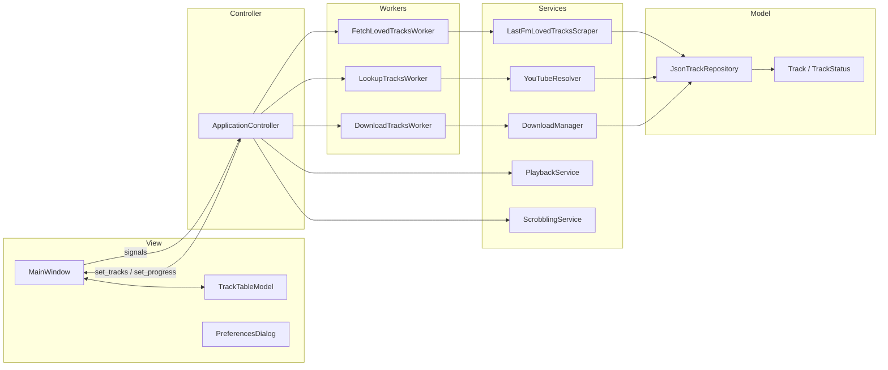
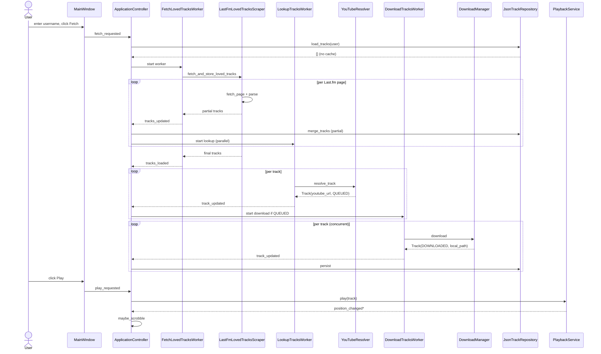
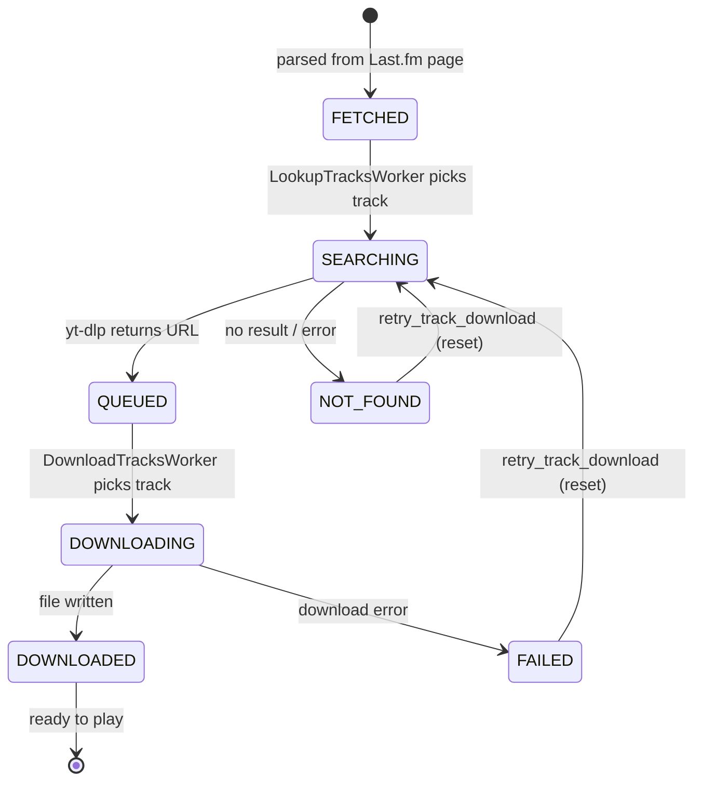
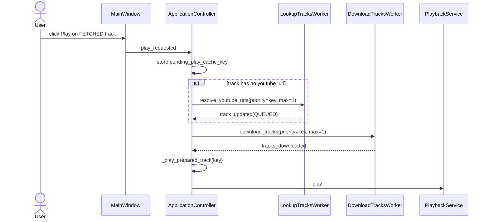
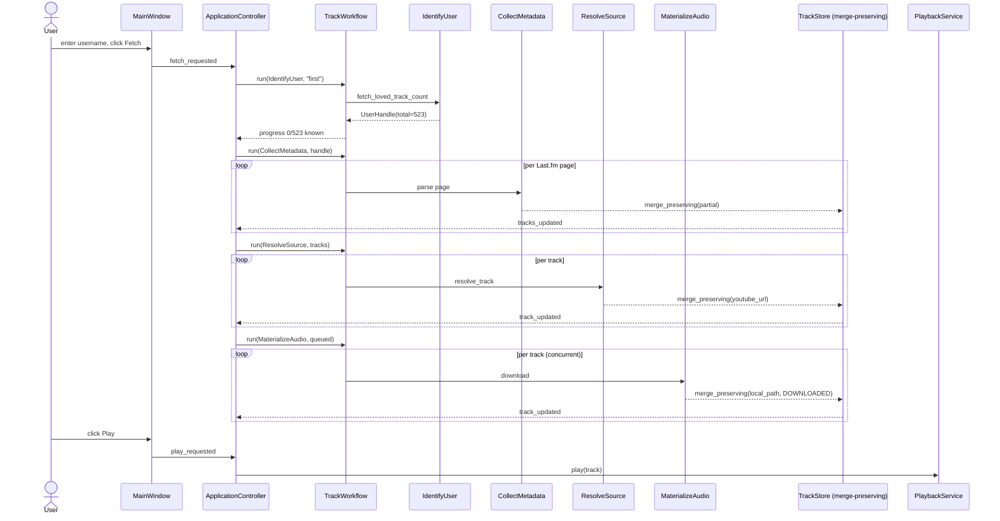

# MVC and Workflow Review

This document is a long-form design review of `myLastFmPlayer` as of `v0.0.81`. It captures the open questions and concerns about the current implementation, walks through the actual data flow in text and diagrams, and proposes how the public interfaces could evolve. **No source code is changed by this document.** It lives in `documents/` purely as a reference and as a prompt for later discussion.

---

## 1. Original notes (cleaned up)

The questions below are the author's own concerns, transcribed and grammar-checked, but with no facts changed.

> The project currently grabs data from Last.fm, puts it into a model, and displays it. The first question is whether this is really a Model–View–Controller workflow, because parts of the pipeline feel layered rather than properly separated.
>
> Concretely:
>
> 1. The additional parsing of every loved track happens one track at a time. The parsed records carry some information — for example, *when* the track was loved — but not every track on Last.fm has that timestamp, so this field is sometimes missing.
> 2. The additional resolving of YouTube downloads is done as a separate phase after parsing.
> 3. The natural flow ought to be: first check the user/artist; then gather information (e.g. when something was released); then queue downloads. Crucially, the later stages should not "overcharge" the pipeline in such a way that earlier information suddenly becomes missing.
>
> I would like a written analysis of how the workflow could be implemented more cleanly, with diagrams showing the interaction and the playback / selection steps. Please produce a single long markdown document inside `documents/`, in plain prose plus sequence and state diagrams (Mermaid is fine if it helps readability), with later ideas added at the end, and a proposal for how the interfaces *would* change — without actually changing the code.

That is the brief this document answers.

---

## 2. Is this really MVC?

Short answer: it is **MVC-shaped**, but several pieces sit outside the classic triangle, and one phase (the *workflow*) is conceptually missing from the textbook MVC vocabulary. The clearest way to describe it is **MVC plus a workflow / service layer**.

### 2.1 What maps to which role

| MVC role | Code | Notes |
| --- | --- | --- |
| **Model** | `my_lastfm_player/models.py` (`Track`, `TrackStatus`) | Immutable dataclass; lifecycle states are an enum. |
| **Model (persistence)** | `my_lastfm_player/storage.py` (`JsonTrackRepository`) | Per-user JSON file plus a shared lookup-cache file. |
| **View** | `my_lastfm_player/ui/main_window.py`, `ui/track_table_model.py`, `ui/preferences_dialog.py`, `ui/flags.py` | Qt widgets and the `QAbstractTableModel` that adapts `Track` to the table. |
| **Controller** | `my_lastfm_player/controller.py` (`ApplicationController`) | Connects UI signals to services and workers, owns thread plumbing. |
| **Services** | `lastfm.py`, `youtube.py`, `download.py`, `playback.py`, `scrobbling.py`, `dependencies.py`, `i18n.py`, `settings.py` | Plain Python objects with one responsibility each. |
| **Workers** | `workers.py` (`FetchLovedTracksWorker`, `LookupTracksWorker`, `DownloadTracksWorker`) | Qt-side adapters that move services onto a `QThread`. |

### 2.2 What is genuinely MVC

- The model is independent of Qt and is testable as plain Python.
- The view never reaches into the network or the filesystem directly. Every "do something" happens by emitting a Qt signal that the controller is connected to (`fetch_requested`, `download_requested`, `play_requested`, `seek_requested`, …).
- The controller never paints. It tells the window what to display via methods like `set_tracks`, `set_progress`, `append_feedback`, `set_now_playing`.

### 2.3 What is *not* classic MVC

- **Services and workers** are not part of the MVC triangle. They form a separate **workflow layer** that the controller orchestrates. The controller is therefore doing two jobs at once: routing UI events (controller in the MVC sense) *and* coordinating a multi-stage pipeline (application service / use-case layer).
- **State spread.** Track state lives in three places: the in-memory list in the `QAbstractTableModel`, the JSON file on disk, and ephemeral fields on the controller (`_pending_play_cache_key`, `_download_worker_active`, `_started_incremental_lookup_for_fetch`). Coordination relies on every path remembering to keep these consistent.
- **The view emits domain intent.** Signals like `retry_download_requested(cache_key)` are domain-level, not UI-level. That is good for testability but does blur the "view is dumb" rule.

So: it is closer to **MVC + Workflow + Repository** than to plain MVC. That is a reasonable shape for a desktop app of this size; the document below proposes giving the workflow layer a clearer name and a stricter contract instead of pretending it does not exist.

---

## 3. The current pipeline — text walkthrough

The end-to-end story for a user named `first` who has never been seen before:

1. **Username entry.** The user types `first` in the `MainWindow` and clicks *Fetch*. `MainWindow` emits `fetch_requested`.
2. **Cache probe.** `ApplicationController.fetch_loved_tracks` first asks `JsonTrackRepository.load_tracks("first")`. If a cache exists, it cross-checks the cached count against Last.fm's online "loved-track count" before trusting it. If the counts match, it short-circuits to *Loaded cached tracks* and starts an automatic YouTube lookup.
3. **Fresh fetch.** Otherwise a `FetchLovedTracksWorker` is moved onto a `QThread`, calls `LastFmLovedTracksScraper.fetch_and_store_loved_tracks`, and walks Last.fm's `user.getLovedTracks` API pages one page at a time with a short `LASTFM_PAGE_DELAY_SECONDS` pause between pages. Each JSON page is parsed into `Track` objects with `(artist, title, lastfm_url, loved_at)`.
4. **Incremental UI updates.** After every page the scraper calls a `tracks_callback` with the cumulative list. The worker re-emits this as `tracks_updated(username, tracks)`. As soon as the first non-empty partial list arrives, the controller does two things:
   - persists the partial list with `repository.merge_tracks` so we never lose work,
   - **launches the YouTube lookup worker in parallel** with the still-running fetch (`_started_incremental_lookup_for_fetch`).
5. **YouTube lookup.** `LookupTracksWorker` runs `YouTubeResolver.resolve_and_store_tracks`, which calls `yt-dlp --dump-single-json` once per track to find the first search hit. Each track transitions `FETCHED → SEARCHING → QUEUED` (URL found) or `→ NOT_FOUND`. Every per-track update is signalled to the controller, which updates the table row and, if the track is now `QUEUED`, may opportunistically start a download.
6. **Download.** `DownloadTracksWorker` calls `DownloadManager.download_and_store_tracks` with a configurable concurrency (default 2). Per-track transitions go `QUEUED → DOWNLOADING → DOWNLOADED` or `→ FAILED`. The controller persists the result and updates the table.
7. **Play.** When the user clicks *Play*, the controller checks whether the track is already `DOWNLOADED` with a real file on disk. If yes, `PlaybackService.play` is invoked. If no, the controller records a `_pending_play_cache_key` and runs the resolve-then-download chain with `priority_cache_key=track.cache_key, max_tracks=1`; the play happens automatically when `_handle_tracks_downloaded` sees the pending key reach `DOWNLOADED`.
8. **Scrobble.** During playback, `_handle_playback_position_changed` watches the elapsed-vs-duration ratio and submits a Last.fm scrobble once the threshold is crossed.

### 3.1 Where the "loved\_at" gap comes in

`lastfm._parse_loved_at` is best-effort. Last.fm renders the timestamp in a `<span title="...">` inside the `chartlist-timestamp` column. If that span is missing, or the date string does not match `%d %B %Y, %I:%M%p`, the function returns `None` and the `Track.loved_at` stays `None`. There is nothing wrong with the parser; the data is genuinely intermittent on Last.fm.

The follow-on consequence is what the original notes describe: a `Track` may travel through the entire pipeline with `loved_at=None`. Later stages (lookup, download) build new `Track` instances with `dataclasses.replace`, so they preserve `loved_at` — but they cannot fill it in either. Once it is missing on page parse, it stays missing.

### 3.2 Where "later stages overcharge" *can* happen today

Two places where a later stage can lose earlier information:

1. **Lookup merge.** `_merge_existing_download_state` (in `youtube.py`) preserves `local_path` / `DOWNLOADED` status across re-resolution, but it only checks two fields. If a future field were added (e.g. `release_year`), the merge would silently drop it on re-lookup unless this helper learned about it.
2. **`Track.from_dict` defaults.** Any field not present in the JSON falls back to `None` / default. If a parser version writes a richer record and a reader version is older, the missing key is silently dropped. The `Track` dataclass uses `slots=True` and `frozen=True`, which is good, but there is no versioning on the persisted records.

Neither of these is a bug right now. They are the seams that the proposal below tightens.

---

## 4. Diagrams

### 4.1 Component diagram



### 4.2 Happy-path sequence (fresh user, fetch → lookup → download → play)



### 4.3 Per-track state machine



### 4.4 Play-from-not-downloaded path



---

## 5. Issues the original notes called out

This section lifts each concern from §1 and matches it to the code.

### 5.1 "Loved-track parsing is per track, and `loved_at` is sometimes missing"

- **Reality.** Fetching is per API page, and the *worker* still emits the whole cumulative list after every page (`tracks_updated`). So in the UI it feels per-track, but the underlying transaction unit is one Last.fm API page.
- **`loved_at` is provided by the API when available.** It is read from `date.uts` and normalized into the app's timestamp format. The current parser returns `None` whenever Last.fm omits the date or sends an invalid timestamp.
- **Therefore.** The model still correctly treats `loved_at` as optional (`loved_at: str | None`) and downstream stages must not overwrite a known value with `None`.

### 5.2 "Downloads are resolved as a separate phase"

- **Reality.** Yes: there are three distinct workers (`FetchLovedTracksWorker`, `LookupTracksWorker`, `DownloadTracksWorker`) and three distinct services. The controller schedules them, and they can run in parallel (the lookup starts before the fetch has finished, and downloads start before the lookup has finished). This is good for throughput but means the controller has to be careful about cross-stage invariants.

### 5.3 "Later stages should not overcharge / drop earlier information"

- **Reality.** Today only `_merge_existing_download_state` and the JSON round-trip protect earlier fields. They are correct for the fields that exist, but they are not general. Any new metadata field added to `Track` has to be remembered by every merge site and every JSON reader. There is no central "merge two Track snapshots, never lose a known field" helper.

These three observations drive the proposal in §6.

---

## 6. Proposal — interface evolution (document only)

The goal is to keep the user-visible behaviour identical, keep all current tests passing, and tighten the seams that the section above flagged. The proposal is split into **terminology**, **data**, and **workflow** changes. Each item names the interface it would touch but does not assume any code change for now.

### 6.1 Terminology

Rename the conceptual layers so the diagrams match the code:

| Today (informal) | Proposed name |
| --- | --- |
| "Controller" | `ApplicationController` *stays as* UI controller. |
| "Worker / service mix" | **Workflow layer**: a `TrackWorkflow` façade owning the three phases. |
| "Services" | **Adapters**: things that talk to Last.fm / YouTube / yt-dlp / Qt media. |
| "Repository" | **Track store** (unchanged). |

The renaming is documentation-only; the Python module names can stay.

### 6.2 Phases as named contracts

Define three explicit phases, each with a typed input and output. This is the document-form analogue of how the `Worker` classes already split the work; the difference is that the *contract* between phases becomes explicit.

| Phase | Input | Output | Owner |
| --- | --- | --- | --- |
| `IdentifyUser` | username | `UserHandle{username, exists, online_loved_count?}` | `LastFmLovedTracksScraper.fetch_loved_track_count` |
| `CollectMetadata` | `UserHandle` | `list[Track]` with `(artist, title, lastfm_url, loved_at?, release_year?, …)` | `LastFmLovedTracksScraper.fetch_loved_tracks` + future enrichers |
| `ResolveSource` | `list[Track]` | `list[Track]` with `youtube_url` set or `status=NOT_FOUND` | `YouTubeResolver` |
| `MaterializeAudio` | `list[Track]` with `youtube_url` | `list[Track]` with `local_path` set or `status=FAILED` | `DownloadManager` |
| `Play` | one `Track` with `DOWNLOADED` | playback session | `PlaybackService` |

Notes:

- `IdentifyUser` is **new as a named step**. Today the controller calls `fetch_loved_track_count` only when checking the cache; the proposal is to *always* run it first so the rest of the pipeline knows the target total up-front. That gives the UI an accurate progress bar from page 1 and lets us decide pagination strategy.
- `CollectMetadata` is a deliberately broad bucket. Today it is just the HTML scrape. The proposal is to make it a small chain — Last.fm HTML scrape → optional MusicBrainz enrichment for `release_year` etc. — that *all run before* `ResolveSource`. This is exactly the "first check user, then info, then downloads" ordering the original notes asked for.

### 6.3 The non-overwriting merge contract

Add a documented invariant on the track store:

> **Merge invariant.** For every field `f` on `Track`, a merge of `old` and `new` must satisfy:
>
> - If `new.f is None` and `old.f is not None`, the result keeps `old.f`.
> - Otherwise the result takes `new.f`.
>
> Status follows a small ordering (`FETCHED < SEARCHING < QUEUED < DOWNLOADING < DOWNLOADED`, with `NOT_FOUND` and `FAILED` as sinks). A merge never downgrades a `DOWNLOADED` track to `QUEUED`.

This is the "later stages should not overcharge" rule from §1, made formal. In code, it would be one helper — for example `Track.merge_preserving(old, new) -> Track` — that every persistence and every cross-stage hand-off would route through. Once that helper exists, the per-field workarounds in `_merge_existing_download_state` collapse into a single call.

### 6.4 Versioned persistence

Today `Track.from_dict` falls back to defaults silently. A small change to the JSON format would harden this without breaking compatibility:

```jsonc
{
  "schema_version": 2,
  "tracks": [ { "...": "..." } ]
}
```

Rules:

- Readers know the highest version they understand. Reading a newer version logs a warning and reads the fields it knows.
- Writers always write the latest version.
- Missing fields are *additions* across versions; renames or removals require an explicit migration step.

No code change in this PR; this is the contract.

### 6.5 Controller slimming

With the workflow layer named, `ApplicationController` could shed two responsibilities:

1. **Thread plumbing.** `_run_worker`, `_active_threads`, `_active_workers`, `_running_worker_count` become a `WorkflowRunner` that owns `QThread` lifecycle for any worker. The controller asks the runner to run a phase; the runner emits one signal per finished phase.
2. **Cross-phase pending state.** `_pending_play_cache_key`, `_pending_retry_cache_key`, `_started_incremental_lookup_for_fetch`, `_download_worker_active`, `_download_stop_requested` describe a small state machine: *"the user wants to play X; we are at stage Y of preparing it"*. That deserves its own type — `PlayPreparation` — with explicit transitions, instead of five booleans/keys living on the controller.

After the slimming, `ApplicationController` is mostly: "wire `MainWindow` signals to `TrackWorkflow.run_phase(...)` and turn results into UI updates." That is the role the textbook MVC controller is supposed to play.

### 6.6 What does *not* change

To be explicit about scope:

- The `Track` dataclass shape stays. New optional fields can be added without breaking anything because of the merge invariant + schema version.
- All existing public methods on `ApplicationController` stay — `fetch_loved_tracks`, `resolve_youtube_urls`, `download_tracks`, `play_selected_track`, etc. They become thin wrappers over `TrackWorkflow`.
- The Qt signal surface on `MainWindow` stays.
- The on-disk JSON layout stays; the version key is additive.

---

## 7. Proposed sequence after the changes

The same happy path, but with the three new contracts visible:



Key differences from §4.2:

- The total track count is known *before* the first page is parsed, so progress is accurate from the start.
- Every cross-phase write goes through one `merge_preserving` call, so a later phase physically cannot drop a field that an earlier phase populated.
- The controller is no longer in charge of `QThread` lifecycle; `TrackWorkflow` is.

---

## 8. Later ideas (not in scope of any near-term change)

These are noted so they are not forgotten, not because they are recommended for the next release.

1. **MusicBrainz enrichment.** In `CollectMetadata`, after the Last.fm scrape, look up `(artist, title)` against MusicBrainz to fill `release_year`, `album`, `mbid`. Rate-limited, cached on disk.
2. **Local audio fingerprinting.** Once a download exists, compute its duration and `ReplayGain` and store both in the track record. That lets the UI show real lengths without relying on `yt-dlp` metadata.
3. **Per-track diff log.** A small append-only file per user that records every state transition with timestamp. Makes it trivial to answer "when did this track move from QUEUED to FAILED, and why?".
4. **Backpressure between phases.** Today the controller decides when to start the lookup worker by checking flags. A small queue between `CollectMetadata` and `ResolveSource` would let `ResolveSource` pull at its own pace and remove the "did we already start the lookup?" flag entirely.
5. **Headless mode.** With the phases as named contracts, a CLI driver becomes a few lines: run all four phases on stdin/stdout, no Qt needed. Useful for batch backfills.
6. **i18n of state names.** `TrackStatus` values are user-facing strings today (`"Fetched"`, `"Not found"`). Splitting "internal enum identifier" from "displayed string" would let the UI translate them while the storage remains stable.
7. **Replace `print(...)` log lines.** `lastfm.py`, `workers.py`, and `controller.py` mix `LOGGER.info` and `print("[myLastFmPlayer] ...", flush=True)`. The dual output is intentional for the local pipeline, but a single structured logger with a console handler would be cleaner once the rest of the structure stabilises.
8. **Snapshot tests for the workflow.** With phases as contracts, each phase can be tested with a fixed input file and a fixed expected output file. Today the equivalent live in `tests/test_lastfm.py`, `test_youtube.py`, `test_download.py` — the proposal is to add one more level above them that exercises the whole pipeline against a recorded Last.fm fixture.

---

## 9. Summary

- The app is MVC-shaped with an explicit workflow layer hiding inside the controller and the workers. Naming that layer (`TrackWorkflow`) and giving each phase a typed contract is the highest-leverage change.
- `loved_at` is intermittent because Last.fm itself omits the timestamp; the right response is to make every cross-phase write *merge-preserving* so the gap never widens later in the pipeline.
- The ordering the original notes asked for — *identify user → collect metadata → resolve source → download → play* — is already present in spirit. Making it explicit (named phases, merge invariant, versioned persistence) costs little and removes the worry that "later stages overcharge earlier information".
- None of this requires changing the visible behaviour of the app, and none of it requires touching the `Track` shape.

This document is the proposal. The code is unchanged.

---

## 10. Feasibility review (self-critique)

Sections 1–9 are the proposal. This section reviews that proposal as an outside engineer would, looks for better paths, and lands on a recommendation. The reviewer's bias is the same one the project memory records: the app already works end-to-end, so any change has to clear a bar of "this pays for itself, and not in some future where the codebase is ten times larger."

### 10.1 Honest reading of the proposal

Going item by item:

| Item from §6 | Real-world value | Risk | Verdict |
| --- | --- | --- | --- |
| Rename "workflow layer" → `TrackWorkflow` | Documentation gain. No runtime difference. | Low if pure rename, medium if it also moves thread plumbing. | **Optional.** Pays off only once a second human reads the code. |
| Named phases (`IdentifyUser`, `CollectMetadata`, `ResolveSource`, `MaterializeAudio`) | Conceptual clarity. The phases already exist as `*Worker` classes, so naming them as a unit is mostly cosmetic. | Low. | **Already true in spirit.** Document, do not refactor. |
| `merge_preserving` helper / merge invariant | Concrete, high value. Eliminates a real bug class (later stage drops earlier field). | Low — small helper plus a few call sites. | **Recommend.** |
| Schema version key in JSON | Hardens future migrations. | Zero today; the project has one reader and one writer in lockstep. | **YAGNI.** Add when there is a real format break. |
| Slim controller: extract `WorkflowRunner` | The `QThread` bookkeeping is the noisiest part of `controller.py`. | Medium — touches every worker path. | **Defer.** Real, but not urgent. |
| Slim controller: extract `PlayPreparation` | Replaces 5 ad-hoc flags with one explicit state. | Low–medium. | **Conditional.** Do it the next time a pending-play bug surfaces. |
| Pre-flight `IdentifyUser` for fresh fetches | Accurate progress from page 1, fail-fast on bad usernames. | Low — one extra HTTP call before the loop. | **Recommend.** |

Two soft assumptions in §6 also need pushback:

- **"Never overwrite a known field with `None`" is too strict.** Some fields *should* be clearable: `error` after a successful retry, `youtube_url` when the user manually re-resolves, `local_path` when a downloaded file goes missing on disk. The invariant has to be **per-field** (or, equivalently: status-driven), not a blanket rule. The §6 wording overstates the safety guarantee.
- **`TrackWorkflow` partially duplicates `workers.py`.** The three workers already form a phase boundary with a typed signal surface (`tracks_loaded`, `tracks_resolved`, `tracks_downloaded`). Adding a façade above them risks two abstractions for the same concept, which is worse than one slightly informal abstraction.

### 10.2 Alternatives considered

- **A. Do nothing.** Defensible. The app works, the memory says to be cautious, and none of the §1 concerns are bugs *today*. Cost: zero. Downside: the next field added to `Track` will probably trip the merge problem again, and the controller keeps accruing flags.
- **B. Minimal patch (merge helper only).** Add `Track.merge_preserving`, route the two existing merge sites through it, ship. Maybe 30–60 lines plus tests. Solves the most concrete concern from §1. This is the smallest correct intervention.
- **C. Minimal patch + pre-flight `IdentifyUser`.** Same as B, plus one extra HTTP call before the fetch loop so progress is accurate from page 1 and bad usernames fail fast. Maybe another 20 lines.
- **D. MusicBrainz enrichment first.** Goes after the original-notes desire ("get info like release year") directly, without any architectural change. Costs a new adapter and a rate-limited cache. Larger lift than B/C and adds an external dependency.
- **E. Event-sourced track timeline.** Each track becomes an append-only list of events; current state is a fold. Solves "where did this field go?" and the diff-log idea in one move. Honest assessment: large refactor, not justified for a single-user desktop app.
- **F. Full §6 proposal.** Everything: rename, runner, preparation, schema version. Coherent vision; cost is a multi-week refactor on a working codebase.

### 10.3 Five pros of the §6 proposal

1. **It names something real.** The "workflow layer" exists today but only as a convention spread across `controller.py` + `workers.py`. Calling it out makes the next contributor's onboarding shorter.
2. **The merge invariant catches a real bug class.** Any future field added to `Track` (release year, album, MBID, duration) would otherwise risk being dropped by one of the cross-phase merges.
3. **Pre-flight identification gives an accurate progress bar from page 1** and rejects typos before doing any heavy work.
4. **Slimmer controller is genuinely easier to reason about** — the five pending-state flags are the area most likely to cause a future bug.
5. **It is non-breaking by design.** The proposal is staged so the on-disk format, the UI signal surface, and `Track`'s shape all stay. The risk envelope is bounded.

### 10.4 Five cons of the §6 proposal

1. **Over-engineered for a one-developer hobby app.** Phases, façades, and runners are the vocabulary of teams with onboarding pipelines, not a single maintainer who already holds the design in their head.
2. **`TrackWorkflow` partially duplicates `workers.py`.** Two abstractions for the same concept is worse than one informal one. The naming gain comes with a real cost.
3. **The merge rule as stated is wrong in detail.** "Never overwrite a known field with `None`" breaks error-clearing on retry, manual re-resolve, and missing-file recovery. The rule must be field-aware before it ships.
4. **Schema versioning is YAGNI today.** One reader, one writer, no external producers. Adding a version key now costs migration thinking forever; adding it on first real break costs nothing extra.
5. **Big-bang refactor risk.** The change-set described in §6 touches `controller.py`, `workers.py`, `storage.py`, and `models.py` together. The project memory explicitly warns against this kind of move on an already-usable codebase.

### 10.5 Recommendation — tiered plan

The honest recommendation is **not "do §6"**. It is a tiered plan that takes the high-value pieces and leaves the rest as documentation.

**Tier 1 — do soon (one small PR each, independently mergeable):**

1. **`Track.merge_preserving(old, new) -> Track`.** Per-field rules, not a blanket "None never wins":
   - `youtube_url`, `local_path`, `lastfm_url`, `loved_at`, `file_type`, `bitrate_kbps`: `None` in `new` does **not** overwrite a known value in `old`.
   - `error`: `None` in `new` **does** overwrite (clearing on retry is intentional).
   - `status`: use an ordering — `FETCHED < SEARCHING < QUEUED < DOWNLOADING < DOWNLOADED`; `NOT_FOUND` and `FAILED` are sinks but can be reset to `FETCHED` by explicit retry. A merge never silently downgrades a `DOWNLOADED` track.
   - `retry_count`: take the max.
   - Replace `_merge_existing_download_state` and the field-by-field logic in `JsonTrackRepository.merge_tracks` (where applicable) with this single helper. Add unit tests for each rule.

2. **Pre-flight `fetch_loved_track_count` on fresh fetches.** Today it runs only as part of the cache-trust check. Always running it first gives the UI a known total before page 1 lands, surfaces bad usernames before any HTML download, and removes the "0 of unknown" progress state. ~20 lines plus a test.

**Tier 2 — do when it stops being free (i.e., when a related bug appears):**

3. **Extract `PlayPreparation` state.** Replace `_pending_play_cache_key`, `_pending_retry_cache_key`, `_started_incremental_lookup_for_fetch`, `_download_worker_active`, `_download_stop_requested` with one small dataclass plus explicit transitions. Trigger: the next bug that traces back to one of those flags being out of sync.

4. **Schema version key in the JSON.** Trigger: the first time a field needs to be renamed or removed, or the first time an external tool needs to read the file.

**Tier 3 — keep as design notes only (do not refactor preemptively):**

5. `TrackWorkflow` façade and the phase rename. Document the concept; don't write the class.
6. `WorkflowRunner` extraction. The `QThread` bookkeeping is noisy but localised; leave it until the controller grows another responsibility.
7. The §8 "later ideas" list stands as written.

### 10.6 Acceptance criteria for Tier 1

So the recommendation is concrete:

- `Track.merge_preserving` exists, is unit-tested for every field rule listed above, and is the single entry point used by `_merge_existing_download_state` and any other cross-phase merge.
- `ApplicationController.fetch_loved_tracks` issues a count query before scheduling `FetchLovedTracksWorker` on a fresh fetch, surfaces a clear "user not found / Last.fm unreachable" message when the count cannot be obtained, and feeds the known total into the progress bar.
- `./localPipeline.sh` is green before and after each PR.
- No change to `Track`'s field set, no change to the JSON layout, no change to `MainWindow`'s signal surface, no change to `ApplicationController`'s public methods.

### 10.7 One-line answer

> **Do Tier 1. Defer the rest. The proposal in §6 is directionally right but priced for a much larger codebase; the merge helper and pre-flight identify-user steps capture ~80% of the value at ~10% of the risk.**
